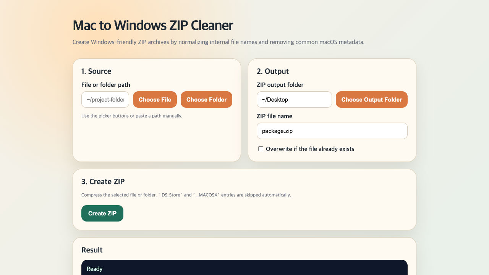

# Mac to Windows ZIP Cleaner

A local macOS web tool that creates Windows-friendly ZIP archives by cleaning macOS metadata and normalizing internal file names.

The main goal is to preserve file and folder names after extraction on Windows. Depending on the unzip tool, the ZIP archive file name itself may still display differently before extraction.

## Screenshot



## Run

Run this from a terminal:

```bash
cd mac-to-windows-zip-cleaner
python3 app.py
```

Or double-click `run_windows_zip_maker.command` in Finder.

## Usage

1. Choose a source file or folder.
2. Choose the output folder.
3. Enter the ZIP file name and click `Create ZIP`.

You can also paste paths manually.

## What It Does

- Normalizes ZIP entry names to NFC Unicode.
- Replaces Windows-forbidden characters such as `:`, `|`, `?`, `*`, `<`, `>`, and `"` with `_`.
- Prefixes Windows reserved names such as `CON`, `PRN`, `AUX`, `COM1`, and `LPT1`.
- Excludes `.DS_Store`, `__MACOSX`, and AppleDouble `._*` metadata files.
- Preserves empty folders.
- Adds `.zip` automatically when the file name has no extension.
- Saves as `_1`, `_2`, and so on when a file with the same name already exists.

## Test

```bash
python3 -m unittest discover -s tests
```

## Notes

- The app runs locally on `127.0.0.1` and does not upload files to an external server.
- It creates standard ZIP files using Python's built-in `zipfile` module.
- It focuses on Windows-friendly internal archive paths, not compression ratio tuning or encrypted archives.
